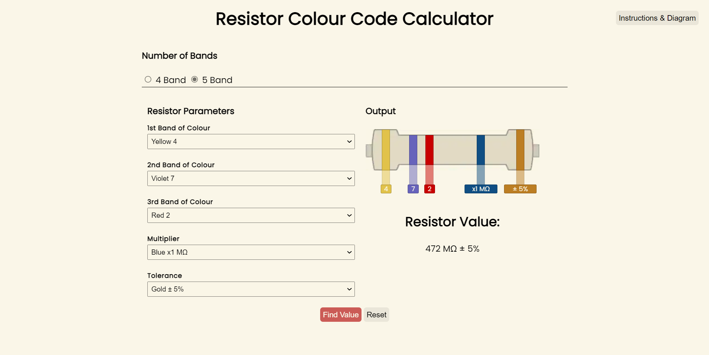
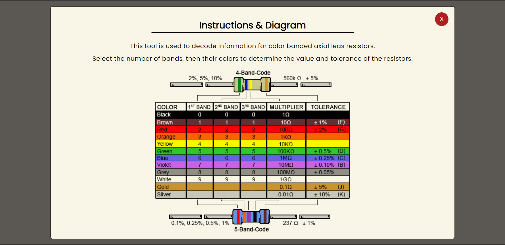

# Resistor Colour Code Calculator
GUI for converting resistor colour codes to their corresponding values in Ohms.  

  

Original idea: [Digikey](https://www.digikey.in/en/resources/conversion-calculators/conversion-calculator-resistor-color-code)
